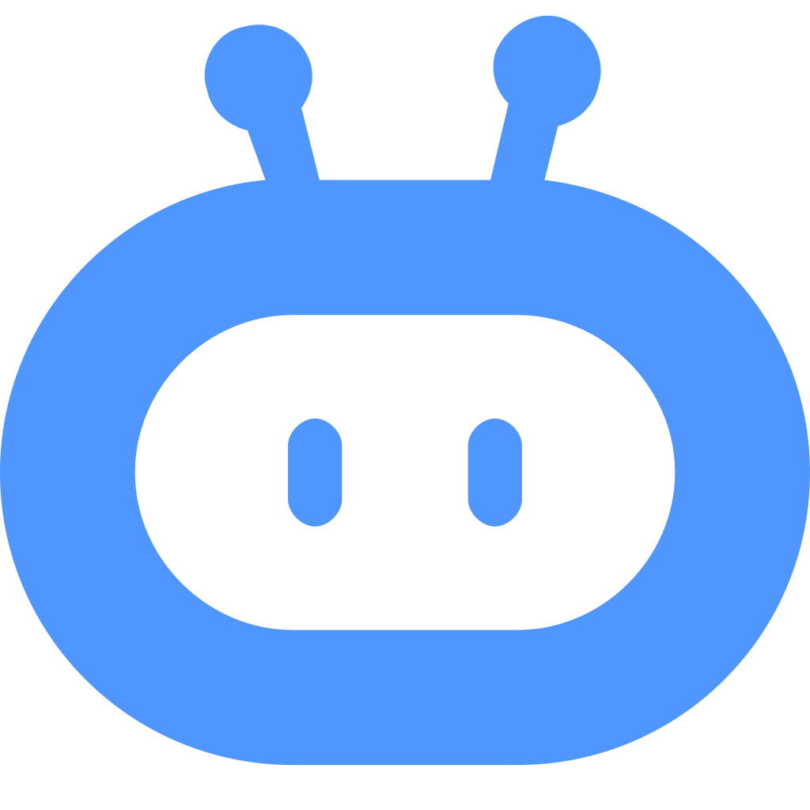
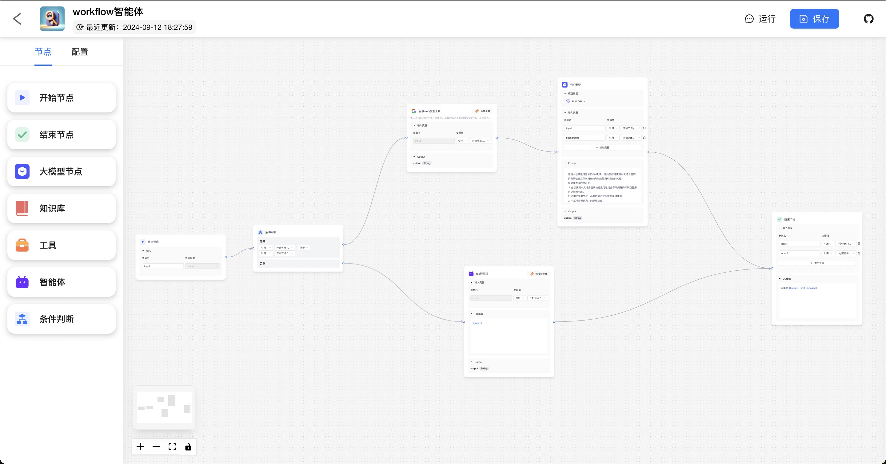
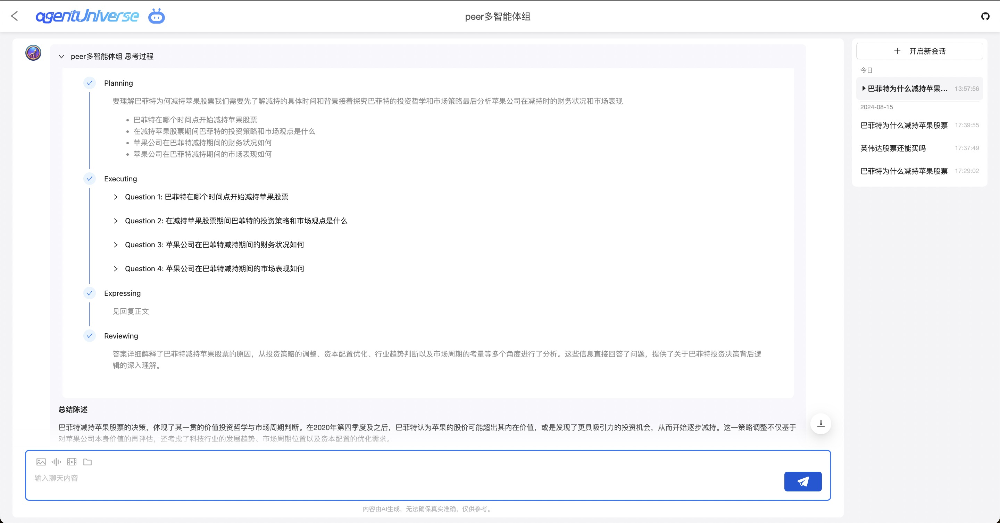
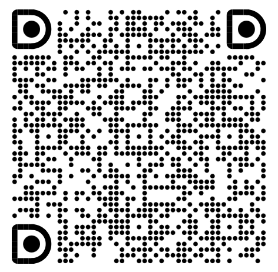

#  magent

Agent Development Product Solution

## magent-ui

Provides auxiliary product capabilities for local code development to facilitate user debugging.

### agentUniverse

Launching a local development product solution in collaboration with [agentUniverse](https://github.com/alipay/agentUniverse), see [Product Documentation](https://github.com/alipay/agentUniverse/blob/master/docs/guidebook/zh/10_1_1_%E4%BA%A7%E5%93%81%E5%8C%96%E5%B9%B3%E5%8F%B0%E5%BF%AB%E9%80%9F%E5%BC%80%E5%A7%8B.md) for details.

Agent Workflow Orchestration


Agent Orchestration


PEER Multi-Agent Dialogue


#### Future Plans

- [ ] Workflow nodes support code nodes
- [ ] Workflow nodes support intent recognition
- [ ] Clearer debugging information

#### Configuration

Supports uvicorn configuration

```python
from magent_ui import launch
launch(host='0.0.0.0', port=8888, root_path='/')
```

##### Configuration Files

- User-level configuration: ~/.magent/ui_config.py
- Project-level configuration: {project_root}/.magent_ui_config.py
- Project-level configuration: {project_root}/config/magent_ui_config.py

```
# ~/.magent/ui_config.py

port=8080
```

##### Environment Variables

MAGENT_UI_SERVER_XX

## Development

[Development Guide](./docs/CONTRIBUTING.md)

## More

#### Submit inquiries via GitHub issues

😊 We recommend using [GitHub issues](https://github.com/difizen/magent/issues) to submit your inquiries. We usually respond within 2 days.

#### Contact us through DingTalk group

😊 Join our DingTalk Q&A group to contact us.


