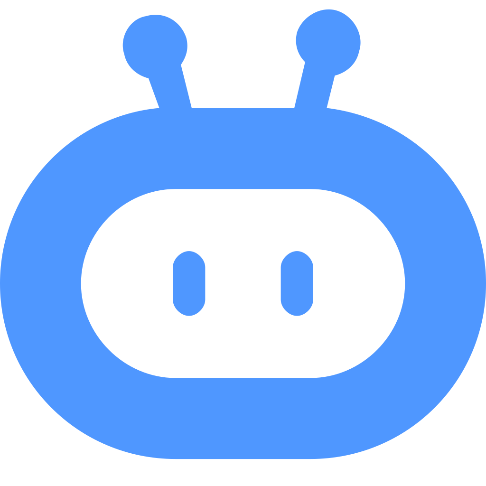
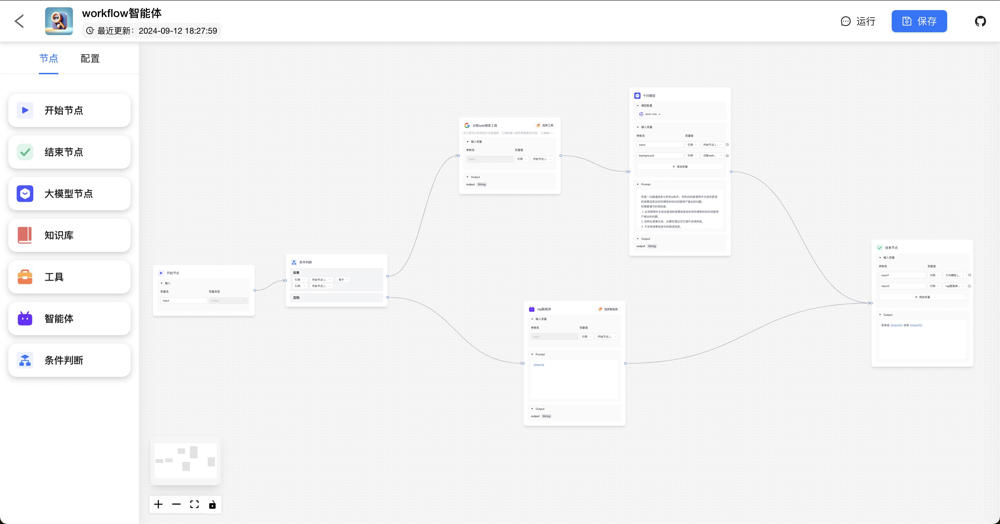
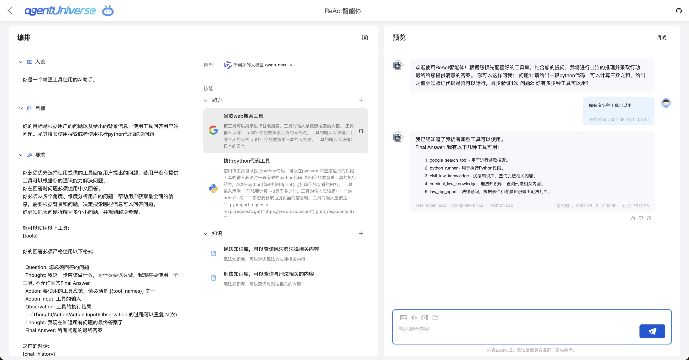
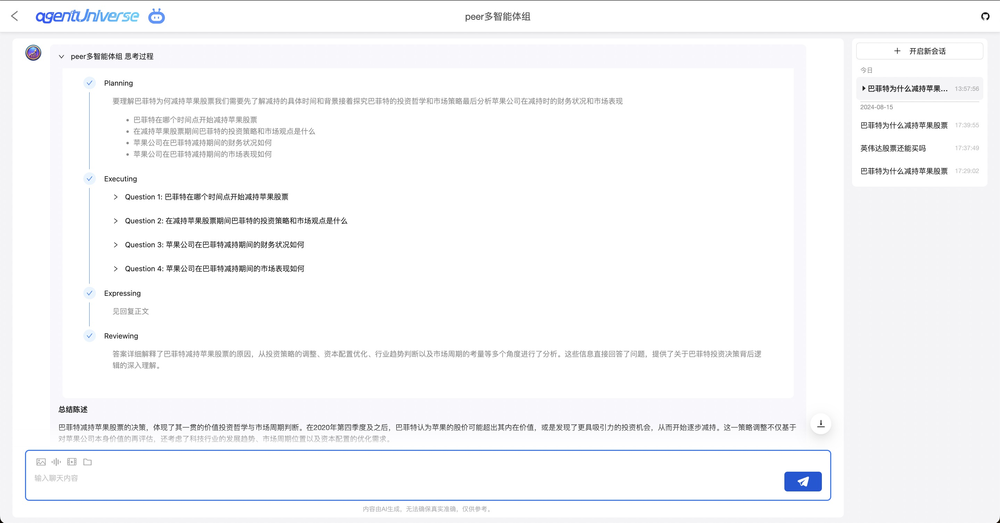
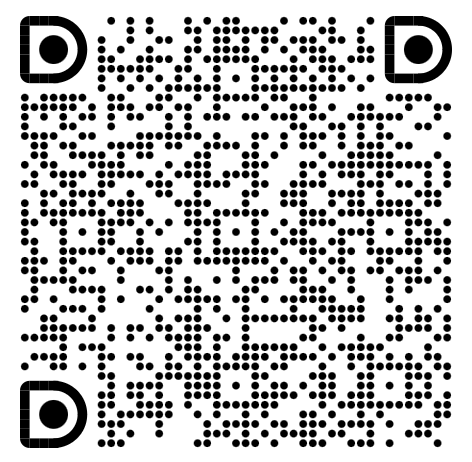

#  magent

智能体研发产品方案

- [magent-ui](#magent-ui) - 为本地代码研发提供辅助产品化能力，方便用户调试。

## magent-ui

为本地代码研发提供辅助产品化能力，方便用户调试。支持多种 Agent 研发框架。

- [agentUniverse](https://github.com/alipay/agentUniverse)
- [langchain](https://github.com/langchain-ai/langchain)

### agentUniverse

与 [agentUniverse](https://github.com/alipay/agentUniverse) 联合推出本地研发产品化方案，详见[产品化文档](https://github.com/alipay/agentUniverse/blob/master/docs/guidebook/zh/10_1_1_%E4%BA%A7%E5%93%81%E5%8C%96%E5%B9%B3%E5%8F%B0%E5%BF%AB%E9%80%9F%E5%BC%80%E5%A7%8B.md)

智能体工作流编排


智能体编排


PEER 多智能体对话


#### 后续计划

- [ ] 工作流节点支持代码节点
- [ ] 工作流节点支持意图识别
- [ ] 更清晰的调试信息

#### 配置

支持 uvicorn 配置

```python
from magent_ui import launch
launch(host='0.0.0.0', port=8888, root_path='/')
```

##### 配置文件

- 用户级配置： ~/.magent/ui_config.py
- 项目级配置： {project_root}/.magent_ui_config.py
- 项目级配置： {project_root}/config/magent_ui_config.py

```
# ~/.magent/ui_config.py

port=8080
```

##### 环境变量

MAGENT_UI_SERVER_XX

## 开发

[开发指南](./docs/CONTRIBUTING.md)

## 更多

#### 通过github issue提交疑问

😊 我们建议您使用[github issue](https://github.com/difizen/magent/issues) 提交您的疑问, 我们通常会在2日内回复。

#### 通过钉钉群联系我们

😊 加入我们的钉钉答疑群与我们联系。


